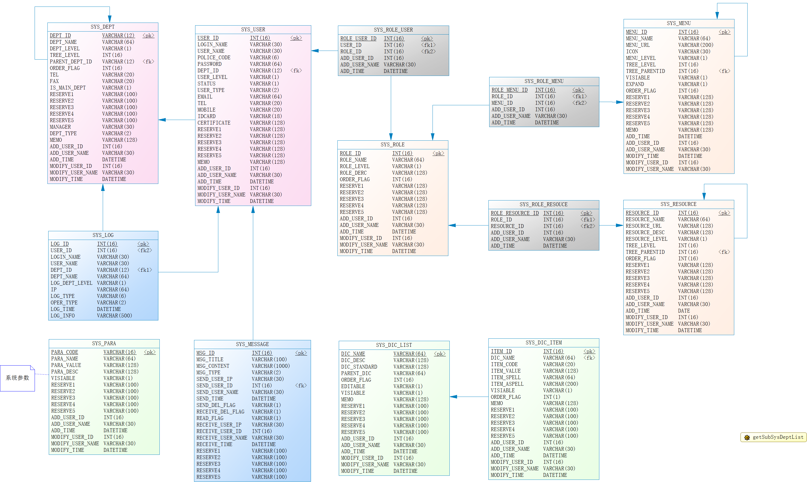

# 系统管理

## 1. 介绍

此项目为系统管理模块。

## 2. 编撰

吴钦飞（wuqinfei@qq.com）。

## 3. 需求分析

涉及到的功能模块，如下图（系统管理 - 用例图）：

1. 部门管理
2. 用户管理
3. 角色管理（权限）
4. 菜单管理
5. 资源管理
6. 字典管理
7. 日志管理
8. 系统参数管理

### 3.1. 部门管理

## 4. 数据库建模

>使用 MySQL 数据库。

如下图（系统管理_物理模型_MySQL）：

